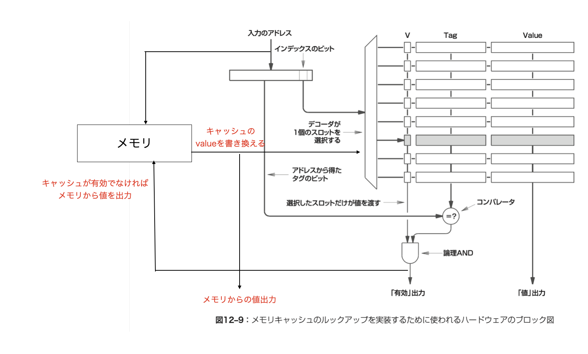

# 12.1
>「トランスペアレント」という言葉は、メモリキャッシュで使うとき、どういう意味になりますか?

>**トランスペアレント**
　キャッシュが「トランスペアレント」(透明)だというのは、要求する側にもデータストアにも変更を加えずにキャッシュを挿入できるという意味である。つまり、キャッシュが要求側に提供するインターフェイスは、データストアが提供するインターフェイスと、まったく同じであり、キャッシュがデータストアに提供するインターフェイスも、要求側が提供するインターフェイスと、まったく同じなのだ。

要求側のプロセッサからは普通にメモリに要求を送るような、メインメモリ側も普通にプロセッサからの要求を受け取るような形のインターフェースで、間にキャッシュが入っても動作すること.

# 12.11
>ダイレクトマップ方式のメモリキャッシュをシミュレートするコンピュータプロラムを書きましょう。64 ブロックのキャッシュを使い、ブロックサイズは 128 バイトとします。プログラムをテストするために、1000 x 1000 の整数配列を作ります。 プログラムが配列を辿る順序が、行ごとの場合と、列ごとの場合で、アドレス参照をシミュレートしましょう。それぞれのケースで、ヒット率は、どうなりましたか?

`12_11.cpp` 参照.

# 12.12
>図 12‒9 が示すハードウェアのブロック図は、ルックアップに必要な回路だけを示しています。この図を拡張して、メモリからキャッシュに値をロードする回路も入れましょう。

